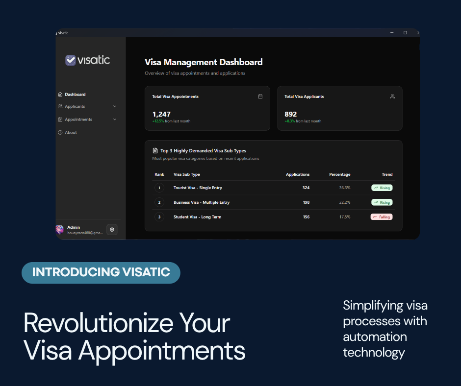

# 🛂 VisaTic – Visa Appointment Booking Solution

A powerful **automation solution** for booking visa appointments efficiently and reliably.  
This system combines a **stealth-enabled automation bot** with a **cross-platform desktop app** for managing applicants and appointments.

  

---

## 🚀 Features

### 🤖 Bot Features

- 🔐 **Persistent Login & Session**  
  Automatically logs in and preserves session state across restarts.

- 🧩 **Captcha Solving (optional)**  
  Integrates with **NoCaptchaAI API** for automatic CAPTCHA solving.

- 📅 **Full Booking Automation**  
  Handles the entire booking process — from visa type selection to selfie verification.

- 🕑 **Timed Form Submission**  
  Precisely control when the bot submits forms during booking.

- 🏁 **Parallel Booking**  
  Run multiple Chrome windows simultaneously (performance depends on CPU threads).

- ⚠️ **Robust Error Handling**  
  Gracefully recovers from both server-side and client-side issues.

- 🔃 **Smart Retry System**  
  Automatically retries during peak hours to increase success rates.

- 🥷 **Anti-Bot Detection Evasion**  
  Mimics genuine user sessions to avoid detection.

- 🧩 **Browser Extension Loading**  
  Supports loading custom or unpacked Chrome extensions.

- 🖥 **Proxy Support (optional)**  
  - Supports HTTP/HTTPS/SOCKS proxies for anonymity.  
  - Checks proxy health before each booking.  

- 🌿 **Optimized Resource Usage**  
  - Blocks unnecessary resources (e.g. media, telemetry, scripts).  
  - Saves proxy bandwidth and system resources.

---

### 🖥 Desktop App Features

- 👥 **Applicant Account Management**  
  Easily add, edit, or delete applicant profiles.

- 🕑 **Appointment Management**  
  Track, view, and manage appointments for multiple applicants.

- 🔑 **Secure Authentication**  
  Login using email and password credentials.

- 🔍 **Daily Log System**  
  Automatically generates logs that can be shared with the developer for support.

- 🪟 **Cross-Platform Support**  
  Works seamlessly on **Windows**, **macOS**, and **Linux**.

---
